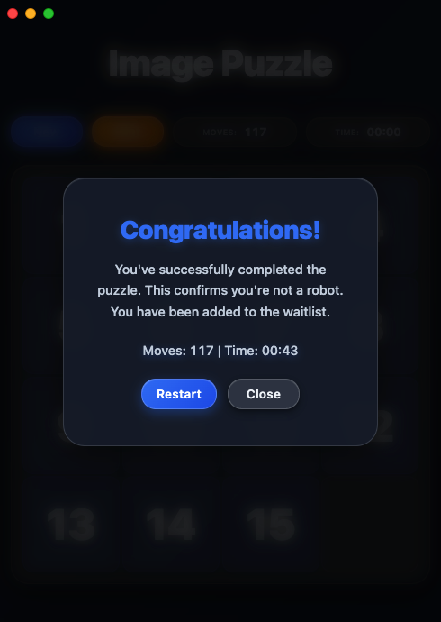

# Image Puzzle

A sliding puzzle game where you reconstruct images.

## Screenshots

| Gameplay | Completed |
|----------|-----------|
|  |  |

## How to Run

```bash
npm install
npm start
```

## How to Play

1. Click "New" to start a game
2. Click tiles to slide them into the empty space
3. Arrange all tiles correctly to complete the puzzle

## Build

```bash
npm run build:win   # Windows
npm run build:mac   # macOS
npm run build:linux # Linux
```

## Features

- Timer and move counter
- Hint button
- Win celebration screen
